# 대규모 사용자 기반의 마이데이터 서비스 안정적으로 운영하기
https://www.youtube.com/watch?v=5I7ehDTvnWA&list=PL1DJtS1Hv1PiGXmgruP1_gM2TSvQiOsFL&index=7

## 장애 대응
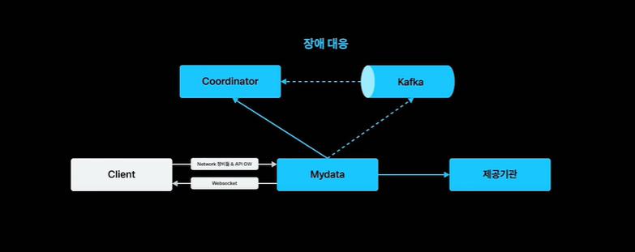
- 마이데이터는 여러 기관과 복잡한 상호작용을 통해 사용된다.
- 제공 기관에서 장애가 발생하면, 그 장애는 마이데이터 서버로 전파되고, 이는 곧 유저에게 전파된다.

 

### <해결 방안>  

1. 기관으로 향하는 트래픽 모니터링
   - 유저당 일정 수 이상의 API 호출이 발생하지 않도록 관리
2. 그럼에도 불구하고 장애가 발생한다면?
   - 제공 기관으로 향하는 트래픽 차단  
    → 제공 기관의 시스템이 복구될 수 있도록 도움

### Resilience4j
> 서킷브레이커를 구현한 오픈소스 솔루션
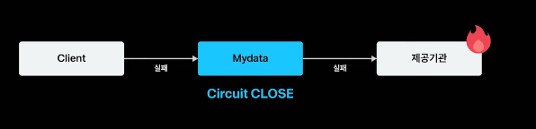
- `Resilience4j`를 이용해서 기관단위로 서킷 브레이커 적용
- 장애가 발생하면 서킷이 오픈되고, 클라이언트에게 '점검중' 문구를 띄움

#### 문제점
- Resilience4j는 서버 단위로 서킷브레이커가 적용
  - case1
      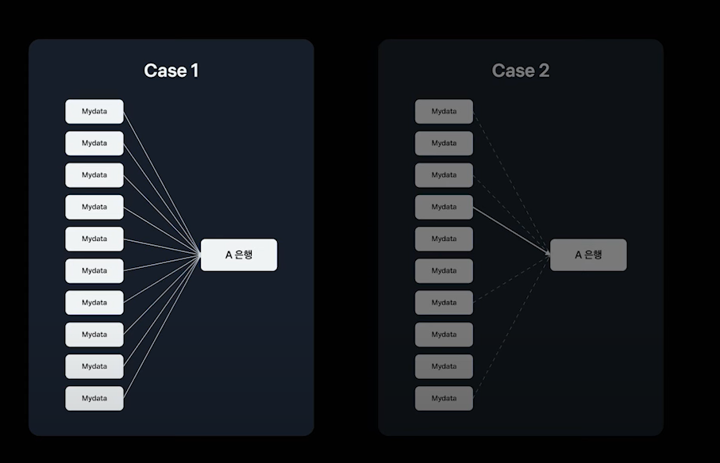
    - 모든 서버가 A은행으로 향하는 트래픽이 발생했을 때,
    - 특정 서버에서 호출한 API만 실패하면
    - 전체 시스템 관점에서 보면 실패율은 10%이지만 실패가 발생한 서버에서 보면 실패율은 100%
    - 서킷이 오픈된다.
  - case2
      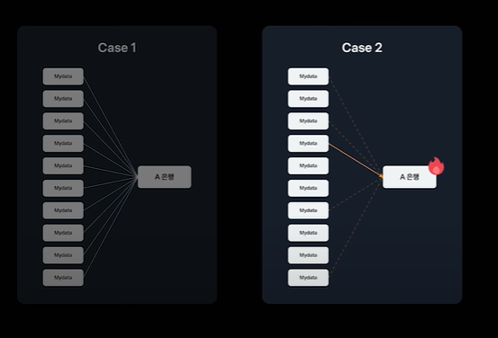
    - 장애가 발생한 A은행으로 발생하는 트래픽이 특정 서버에만 몰렸을 때,
    - 동일하게 트래픽이 몰린 서버는 즉시 서킷이 오픈됨.
    - 서버마다 서킷의 상태가 달라지게 되면, 시스템이 일관된 서비스를 제공하지 못함.

이 문제를 해결하기 위해, 다른 방안(Coordinator) 선택.

### Coordinator
> 마이테이터 트래픽을 제어하고 모니터링 하는 시스템
#### 선택지1. 마이데이터 서버에 구현
- 여러 서버와의 의존성
- 장애가 발생할 확률이 높음
  
  장애가 발생한 서버가 코디네이터 역할을 하던 서버라면 전체 시스템 기능에 중단이 발생 → 좋지 못함

#### 선택지2. 별도의 서버에 구현
- 장애 포인트 일원화
- 유연하고 확장 가능한 시스템

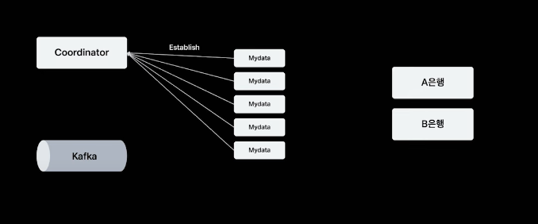 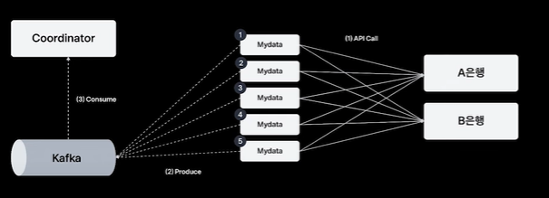
- 마이데이터 서버
  - 처음 쿠버네티스 클러스터에 배포될 때 코디네이터 서버에게 establish 요청을 보냄
- 코디네이터 서버
  - 요청이 온 마이데이터 서버를 마이데이터 클러스터 목록에 편입, 서버 아이디를 발급
  - 지속적으로 마이데이터 서버로부터 하트비트 요청이 오는지 확인
- 마이데이터 서버
  - 발급받은 서버 아이디를 이용해서 분산 환경에서 유니크한 API 트랜잭션 아이디를 생성하여서 제공 기관을 호출
  - 성공 실패 여부를 카운트하여서 잠시 동안 버퍼에 쌓아두었다가 카프카로 전송

#### 서킷 오픈 조건
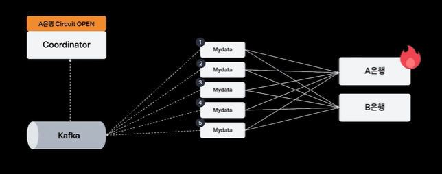
- 코디네이터 서버
  - 카프카로부터 데이터를 consume
  - 분단위로 실패 통계 데이터 생성
  - `실패율이 임계치가 넘어간 기간`이 있다면 일정 시간 동안 서킷 오픈
- 마이데이터 서버
  - 10초에 한 번씩 코디네이터 서버에게 서킷이 오픈된 기관 목록이 있는지 API를 요청
  - 결과를 다음 10초까지 로컬에 캐싱해두고, 장애가 나는 기관으로 향하는 트래픽 차단

#### 서킷 클로즈 조건
- 코디네이터 서버는 가장 먼저 배포된 서버와 가장 마지막에 배포된 서버 2대를 마스터로 지정
  - 서킷이 오픈된 기관 목록을 요청할 때 마스터 서버를 대상으로만 빈 응답을 주어서 장애 상태를 모르도록
  →  마스터 서버만 장애가 발생한 기간으로 API 호출이 발생  
  →  표본 수집 가능  
  - 1분 뒤 장애가 해소되었다면 정상적으로 서킷 클로즈
- 서킷이 클로즈 된 후, 다음 사이클에 모든 서버가 로컬 캐시가 리프레시
- 장애가 발생했던 서버로 다시 트래픽 발생

#### 처음과 마지막 서버가 마스터인 이유?
> 토스의 배포 방식 때문!
- 점진적인 배포방식인 카나리 방식(일시적으로 서버의 수가 두 배)
- 올드 버전에서 뉴 버전으로 트래픽 전환이 일어남
- 이 때, 어느 쪽으로 트래픽이 가더라도 최소 한 대의 서버는 표본을 수집하기 위해 가장 처음과 마지막에 배포된 서버가 마스터를 담당

## 시스템 부하 개선
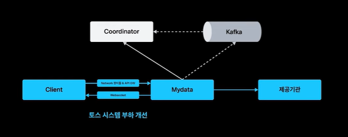 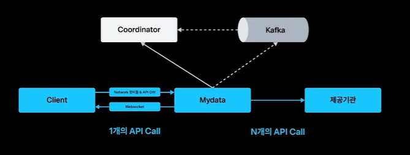
- 마이데이터 API 중에는 한 번의 마이데이터 서버 API 호출에 N번의 제공기관 API 호출이 발생하는 API가 존재 ex) 자산 등록
- 제공 기관 의존성이 있는 API의 경우, 제공 기관의 응답 속도에 따라 전체 API 실행 시간이 결정됨

#### 사례(자산 등록)
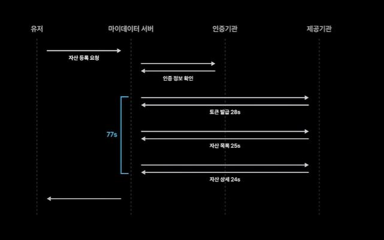
1. 유저로부터 자산 등록 요청
2. 인증 기관에 유저가 실제로 인증을 했는지 확인
3. 자산 정보를 가져오기 위해 토큰을 발급 요청
4. 발급받은 토큰을 이용해서 자산 목록을 가져옴
5. 자산 목록을 기반으로 상세 정보를 가져옴

> 총 77초의 시간이 소요됨.  
> 77초가 소요되기 때문에 유저가 이탈할 수 있지만, 유저가 다시 서비스에 진입했을 때 결과를 확인할 수 있어야 함.

하지만, 이렇게 긴 API 처리는 문제가 된다!
#### 긴 API 처리가 문제 되는 이유
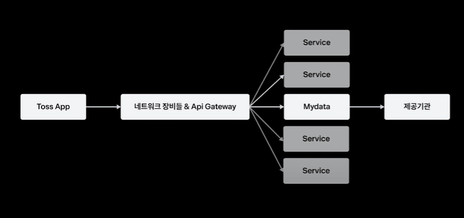
>  토스의 인프라 점유 시간이 길어지기 때문
- 마이데이터 서버를 호출하면 여러 네트워크 장비와 게이트웨이를 지나 마이데이터 서버에 패킷이 도달
- 이때, 각 네트워크 홉들은 다음 네트워크 홉의 응답이 오기를 기다리며 커넥션을 유지
- 이 네트워크 홉은 여러 서비스가 공용으로 사용하는 리소스이기 때문에, 특정 서버의 응답이 느려지게 되면 토스의 트래픽 입구에 가용성 문제가 발생함

따라서, 해결 방안 검토

### Websocket vs Polling
> Websocket win!

왜? 대용량 트래픽이 발생하는 마이 데이터 서버에 잦은 폴링 요청으로 부하를 주기보다 웹소켓이 효율적이라고 판단했기 때문

#### 웹소켓 적용 후 동작
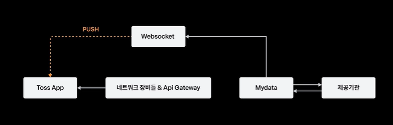
1. 서비스 접근 시, 웹소켓 서버와 커넥션을 맺음
2. 이때 맺어진 커넥션을 서버 푸시가 필요한 다양한 서비스들이 공유해서 사용
3. 유저가 긴 API 요청 보냄
   - 마이데이터 서버는 API를 얼리 이탈하고, 즉시 공용 리소스들을 해제
   - 클라이언트는 웹소켓으로부터 서버푸시가 오는지 기다림
   - 마이데이터는 비동기적으로 자산 등록 과정을 해결
   - 완료되는 구간마다 서버 푸시로 클라이언트에게 알려줌  
   → 동적으로 화면 구성 가능!

## 피크 트래픽 제어
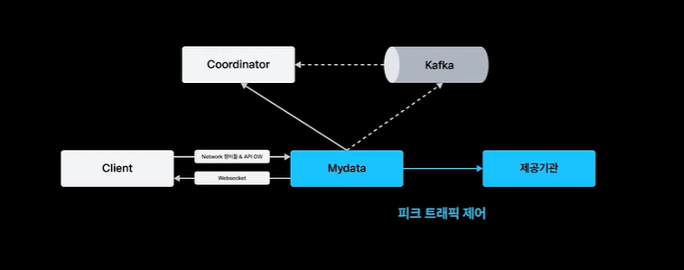

### 트래픽 호출 균일화
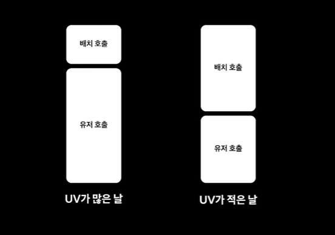
#### 마이데이터 API 타입
1. 유저의 액션에 의해 발생하는 유저 호출
2. 유저의 동의 하에 7일에 한 번씩 유저의 자산을 토스에서 갱신할 수 있는 배치 호출
    - 하루 중 6시간 동안 제공 기관에서 허용해 준 시간대에만 호출 가능
#### 일주일 호출 균일화
- 유저 트래픽이 몰리는 패턴을 찾는다.
  1. 월급날
  2. 증권 거래날(평일)
- 유저 트래픽이 높은 날에는 배치 호출을 낮추고, 트래픽이 적은 날엔 배치 호출의 수를 높인다.  
  → 7일간 발생하는 트래픽의 총량은 동일하지만, 특정일에 과도하게 트래픽이 발생해서 장애가 나는 것 방지

#### 하루 호출 균일화
- 배치 호출을 실행하는 배치 애플리케이션은 하루가 시작되는 시점에 오늘 호출해야 하는 배치 호출 대상자의 유저의 수를 계산
- 호출 허용 시간대가 되면 1분간 실행해야 하는 배치 호출의 대상 유저 수를 다시 한 번 계산
  - 제공 기관의 배치 호출의 허용 시간대를 분 단위로 설정할 수 있기 때문
- 실제 호출은 유저 한 명당 N번의 API 호출이 발생  
  → 동시 호출 수를 최소화하기 위해서 1분간 실행해야 하는 유저를 다시 100밀리세컨드로 나누어서 배치 호출을 실행

#### 코드로 살펴보기
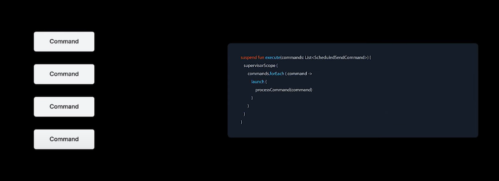
- 기간과 유저의 범위를 커멘드라는 객체로 표현
- 실제 상황에서는 1분간 실행해야 하는 기관의 수가 n개 존재  
- 1분간 n개의 기간을 실행해야 하기 때문에 별도의 코루틴에서 이를 `병렬로 실행` 

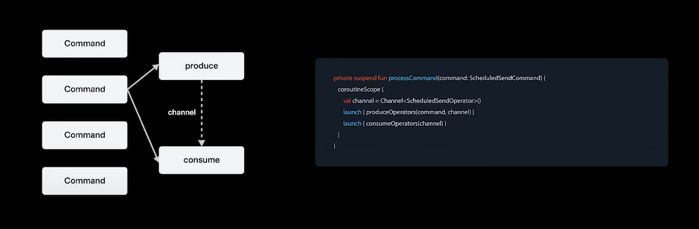
- 두 개의 코루틴
  1. 일정한 간격으로 데이터베이스에서 `대상자 정보`를 가져오는 코루틴
  2. 대상자 정보를 다시 `100밀리세컨드 단위로 나누어서 실행`하는 코루틴
- 이 두 개의 코루틴을 코루틴 채널을 이용해 잇는다.

> **코루틴 채널**  
> 비동기 프로그래밍인 코루틴 간에 데이터를 주고받을 수 있는 통신 메커니즘  
> 하나의 코루틴에서 데이터를 보내고 다른 코루틴에서 이를 받아서 처리할 수 있음

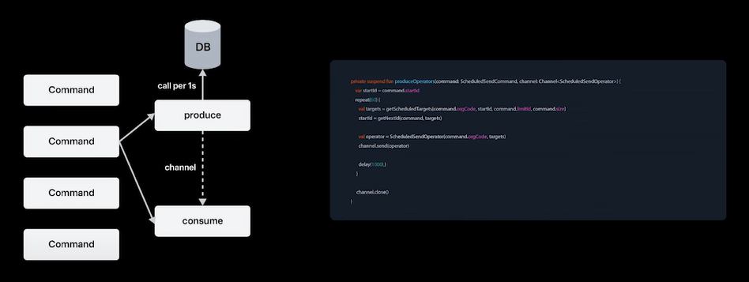
- produceOperator
- 데이터베이스에서 대상자 정보를 1초마다 소분해서 가져와서 채널로 프로듀스 해주는 코드
- 대상자 정보를 한 번에 데이터베이스에서 가져오지 않는 이유?
  - 배치 유출이 활발히 실행되는 시점에는 1분간 데이터베이스에서 가져와야 하는 수가 4만 개가 넘기 때문
  - 슬로우 쿼리 발생 우려(다른 코루틴에 영향을 줌)
- 이후 60초 동안 프로듀스가 완료되게 되면 채널은 정상적으로 클로즈

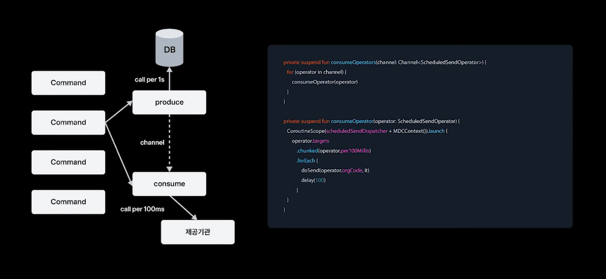
- 컨슘 코드
- 채널로부터 오퍼레이터 객체를 받아서 100밀리세컨드마다 소분해서 실행
- 코루틴 scope 분리
  - structure concurrency(하위의 코루틴이 종료되지 않으면 코루틴 스코프를 벗어나지 않음)라는 특성 때문
  - 실제로는 채널로부터 오퍼레이터 객체가 도착했지만 하위의 코르틴이 종료되지 않아서 즉시 실행하지 못하는 문제가 발생할 수 있음
  → 코루틴 스코프를 분리해 비동기로 실행
- 프로듀서 쪽에서 채널이 클로즈 → 컨슈머 쪽에도 for문이 닫히면서 1분간 배치 호출이 종료

