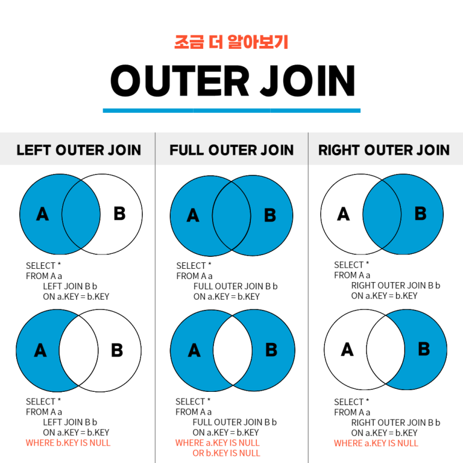
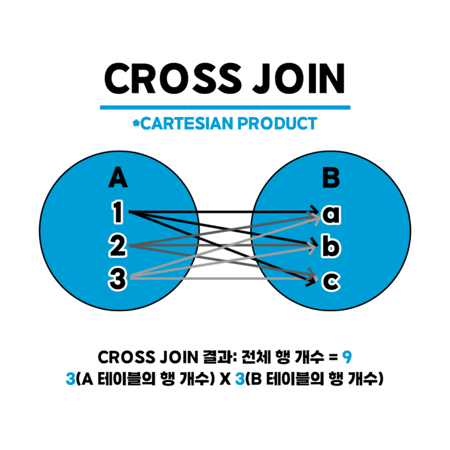

# MY SQL 기초

## <기초 정보>
- PRIMARY KEY(PK) : 기본 키. 중복되지 않고, 비어있지도 않은 키
- SCHEMAS 창에 굵은 글씨로 표시된 db가 현재 사용중인 db
- 세미콜론(;)이 나올 때까지는 한 문장.
<BR><bR>

## <테이블 생성>
```sql
CREATE TABLE 테이블명(열_이름 데이터_타입 조건, 열_이름 데이터_타입 조건 ..);
```
<BR>

## <데이터 변경 문법 - 삽입, 업데이트, 삭제>
- INSERT   
	-> 테이블에 데이터를 삽입하는 명령   
    ```sql
	INSERT INTO 테이블명 (열1, 열2 .. ) VALUES 값1, 값2 ..;
    ```
	열 이름 생략 가능. 생략할 경우에 값들의 순서와 개수는 테이블의 열 순서 및 개수와 순서가 같아야 함   
	> AUTO INCREMENT   
		> - INSERT문을 실행할 때마다 자동으로 숫자값을 1부터 1씩 증가시켜줌   
		> - CREATE문에서 옵션을 입력하여 설정할 수 있음.   
		<pre>
        <code> CREATE TABLE 테이블명(열_이름 데이터_타입 조건 AUTO_INCREMENT PRIMARY KEY, 열_이름 데이터_타입 조건 ..);   </pre></code>
		> - ALTER TABLE을 이용하여 시작 값을 조정할 수 있음   
        <pre><code> ALTER TABLE 테이블명 AUTO_INCREMENT=원하는값;   </pre></code>
		> - 증가하는 양을 조정할 수 있음.   
        <pre><code> SET @@auto_increment_increment=원하는값;   </pre></code>


- INSERT INTO ~ SELECT   
	-> 조회한 값을 한 번에 입력하는 방법   
	
    ```sql
    INSERT INTO 삽입할_테이블명 SELECT 열이름 FROM 조회_테이블명;
    ```
     
- UPDATE	   
	-> 기존에 입력되어 있는 값을 수정   
    ```sql
	UPDATE 테이블명 SET 열1=값1, 열2=값2 .. WHERE 조건;
    ```
	** 업데이트가 안 되는 경우 워크벤치 설정을 풀어줘야 함. (EDIT-PREFERENCE-SQL EDITOR-SAFEUPDATE체크 해제-워크벤치 재실행)
	WHERE절을 뺄 경우 테이블 해당 열의 모든 값이 설정값으로 변경됨(주의 필요)
- DELETE   
	->테이블의 행데이터를 삭제
    ```sql
	DELETE FROM 테이블명 WHERE 조건;
    ```

<BR><BR>

## <SELECT문>
```sql
SELECT 열_이름 FROM 테이블 이름 WHERE 조건식 GROUP BY 열_이름 HAVING 조건식 ORDER BY 열_이름 LIMIT 숫자;
```

### SELECT 열 이름 FROM 테이블 이름;    
- 테이블의 어떤 열을 사용하겠다. 
- 테이블 전체를 사용하고싶을 경우엔 *로 표시
- SELECT한 테이블이 db에 없으면 오류 발생.

### WHERE   
- 조건을 주는 코드
    ```sql
    SELECT 열 이름 FROM 테이블 이름 WHERE 조건; 
    ```
- AND(둘 다 만족)또는 OR(둘 중 하나만 만족)을 사용해서 조건 여러 개 사용 가능
- BETWEEN    
-> 숫자 범위 조건일 경우 BETWEEN 조건1 AND 조건2 의 형태로 사용 가능   
    ```sql
    //동일한 코드
    WHERE height >= 163 AND height <= 165; 
    WHERE height BETWEEN 163 AND 165;
    ```
- IN   
-> 숫자 범위가 아니고, 여러 개 중 하나 만족일 경우 IN사용 가능
    ```sql
    //동일한 코드
    WHERE addr = '경기' OR addr = '전남' OR addr = '경남'; 
    WHERE addr IN('경기', '전남', '경남');
    ```
- LIKE  
-> 문자를 비교. 정확하지 않은 글자를 조건으로 줄 때 사용.    
'_'는 한 글자 '%'는 여러글자를 의미
    ```sql
    WHERE mem_name LIKE '우%'; // '우'로 시작하는 회원 이름 검색. 뒤는 상관 없음
    WHERE mem_name LIKE '__핑크'; // 미지정 한 글자당 _ 하나로 표시
    ```

- db이름.테이블 이름    
	-> 테이블이 어디 db에 있는지 명시하는 방법.    
	다른 db를 잠시 use할 때 사용. 그러나 보통 여러 db를 한 번에 사용하는 경우가 많이 없기 때문에 잘 사용하지는 않음 
- Alias    
	-> 별칭을 주는 방법. 띄어쓰기하고 뒤에 별칭을 적어주거나, AS를 사용하면 됨   
	별칭에 띄어쓰기가 있을 경우 큰따옴표로 묶어주기   

	```sql
    SELECT 열 이름 AS 별칭, 열 이름2 "다른 별칭" FROM 테이블 이름; 
    ```
    


### ORDER BY   
-  결과값이나 개수에 영향을 미치지 않고, 출력에만 영향   
	* ASC    
    -> 오름차순 정렬. 기본적으로 오름차순이기 때문에 보통 생략
	* DESC   
    -> 내림차순 정렬
	동률일 경우 해결할 조건을 여러 개 줄 수 있음. 앞에 나온 조건이 우선적으로 처리됨
	```sql
    ORDER BY height DESC, debut_date ASC; 
        -> 키를 기준으로 정렬 후 동률인 열에 대해 데뷔일 기준 재정렬
    ```
### LIMIT   
- 출력할 행 개수 정해줌   
- ```LIMIT a, b; ```로 할 경우 a번째부터 b개 행만큼 출력
### DISTINCT   
- 중복된 데이터를 하나로만 보여줌  
    ```sql
        SELECT DISTINCT addr FROM member; 
            -> 멤버 테이블에 있는 주소 열을 중복되지 않게 출력
    ```

### GROUP BY   
- 그룹으로 묶어주는 역할   
	SUM() - 합계를 구함   
	AVG() - 평균을 구함   
	MIN() - 최소값을 구함   
	MAX() - 최대값을 구함   
	COUNT() - 행 개수를 셈 -> 열 이름을 ()안에 적어줄 경우 NULL값을 제외한 나머지 행을 count   
	COUNT(DISTINCT) - 중복을 제외하여 행 개수를 셈   
    ```sql
	SELECT mem_id, SUM(amount) FROM buy GROUP BY mem_id; 
        -> buy테이블의 member_id열을 선택하는데, mem_id별로 구매 양 합계를 구해서 출력
    ```
	
### HAVING    
- 그룹 함수에서 조건을 쓸 경우 WHERE절이 아닌 HAVING에 넣어줘야 함.   
    ```sql
    SELECT mem_id, SUM(amount*amount) FROM buy GROUP BY mem_id HAVING SUM(amount*amount)>1000 ; 
        ->  buy테이블의 member_id열을 선택하는데, mem_id별로 총 구매 금액을 구해서 1000이 넘는 행만 출력
    ```

<BR><BR>

## <데이터 형식>
- 크게 숫자형, 문자형, 날짜형으로 나뉨
### 숫자형
-  정수형   
  -> 소수점이 없는 숫자	   
  -> UNSIGNED 예약어를 사용해서 0부터 시작하는 양수로 만들 수 있음.
    <table>
        <tr>
        <td>데이터 형식</td><td>바이트 수</td><td>숫자 범위</td>
    </tr>
    <tr>
        <td >TINYINT<td>1<td>-128~127 </td>
    </tr>
    <tr>
        <td>SMALLINT<td> 2<td>-32768~32767 </td>
    </tr>
    <tr>
        <td >INT<td>4<td>약 -21억~ +21억</td>
    </tr>
    <tr>
    <td>BIGINT<td>8<td>약 -900경 ~ +900경</td>
    </tr>
    </table>
- 실수형   
    -> 소수점이 있는 숫자
    <table>
    <tr>
    <td>데이터 형식</td><td>바이트 수<td> 설명</td>
    </tr>
    <tr>
        <td >FLOAT<td>4<td>소수점 아래 7자리까지 표현</td>
    </tr>
    <tr>
        <td>DOUBLE<td>8<td>소수점 아래 15자리까지 표현</td>
    </tr>
    </TABLE>

### 문자형   
- 입력할 최대 글자수를 정해야 함   
    <table>
        <tr>
        <td>데이터 형식</td><td>바이트 수</td>
    </tr>
    <tr>
        <td >CHAR(개수)<td>1~255</td>
    </tr>
    <tr>
        <td>VARCHAR(개수)<td>1~16383</td>
    </tr>

    </table>
- CHAR의 경우 최대 글자수만큼 무조건 공간을 차지하기 때문에 VARCHAR을 사용하는 것이 공간을 더 효율적으로 운영 가능
- CHAR이 속도가 더 빠름

### 날짜형
- 날짜 및 시간을 저장할 때 사용
    <table>
    <tr>
    <td>데이터 형식</td><td>바이트 수<td> 설명</td>
    </tr>
    <tr>
        <td >DATE<td>3<td>날짜만 저장. YYYY-MM-DD형식</td>
    </tr>
    <tr>
        <td>TIME<td>3<td>시간만 저장. HH:MM:SS형식</td>
    </tr>
        <tr>
        <td>DATETIME<td>8<td>날짜와 시간 저장. YYYY-MM-DD HH:MM:SS 형식</td>
    </tr>
    </TABLE>

<BR><BR>
## <변수>
```sql
SET @변수이름 = 값;         //변수 선언과 동시에 값 대입
SELECT @변수이름;          //변수 값 출력


//프로시저문 안
DECLRE 변수이름 자료형; //변수 선언
SET 변수이름 = 값; //변수에 값 대입
```
- 영구저장되는 것이 아니라 임시저장
- SELECT문의 LIMIT에는 사용할 수 없기 때문에, PREPARE과 EXECUTE문 사용
    ```sql
    SET 변수명=값;
    PREPARE 이름 FROM '원하는 구문 ?';
    EXECUTE 이름 USING @변수명;

    //예제
    SET count=1;
    PREPARE abc FROM 'SELECT name, height FROM table_A ORDER BY height LIMIT ?';
    EXECUTE abc USING @count;
    //물음표 자리에 USING뒤 변수가 들어감
    ```

- SELECT 열 이름 INTO 변수명 ~~ 을 이용하면 테이블 값을 변수에 저장 가능

## <데이터 형 변환>
### 명시적인 변환
- 함수를 사용해서 ```강제로``` 변환하는 것
-  CAST, CONVERT 함수 사용
    ```sql
    //결과는 동일, 형태만 다름. 길이는 생략 가능
    CAST(값 AS 데이터형식 길이)
    CONVERT(값, 데이터형식 길이)
    ```

### 암시적인 변환
- 별도 지시 없이 ```자동으로``` 변환되는 것
    - 숫자 형태의 문자끼리 더할 경우 숫자로 변환되어 연산 ex) '100'+'200'
    - CONCAT을 이용하여 문자와 문자, 문자와 정수를 연결할 경우 문자로 처리


<BR><BR>

## < JOIN >
- 두 개의 테이블을 묶어서 하나의 결과를 만들어내는 것   
* __```일대다 관계```__
    - 한쪽 테이블에는 하나의 값만 존재해야 하고, 연결된 다른 테이블에는 여러개의 값이 존재할 수 있는 관계
    - 주로 기본 키(PK)와 외래 키(FK) 관계로 맺어져있어서, 일대다 관계를 'PK-FK 관계'라고 부르기도 함
### 내부 조인 (INNER JOIN)
- 조인 중에서 가장 많이 사용됨
- 일대 다의 관계가 이루어져 있어야 함
    ```sql
    SELECT <열 목록>
    FROM 첫_번째_테이블
        INNER JOIN 두_번째_테이블
        ON 조인_조건
    WHERE 검색_조건;

    //WHERE은 생략 가능
    //INNER JOIN을 JOIN이라고만 써도 됨
    ```
- 첫 번째 테이블 해당 열의 내용을 출력한 뒤 첫 번째 테이블에서 조인 조건이 맞는 열을 이어서 출력함   
- 열을 선택할 때, 열 이름이 양쪽 테이블에 모두 존재하는 경우 테이블을 명시해줘야 함.
- 테이블에 별명을 붙여주고, 이를 이용해서 열 선택시 명시해줘도 됨
- ```내부 조인의 한계점```
    - 양쪽 테이블 모두 지정한 열의 데이터가 있어야만 결과 도출 가능   

### 외부 조인 (OUTER JOIN)
- 내부 조인의 한계점을 극복. 한 개의 테이블에만 데이터가 있어도 결과 도출 가능
    ```sql
    SELECT <열 목록>
    FROM 첫_번째_테이블(LEFT 테이블)
        <LEFT | RIGHT | FULL> OUTER JOIN 두_번째_테이블(RIGHT 테이블)
        ON 조인 조건
    WHERE 검색_조건;
    ```
   
<BR>

- LEFT OUTER JOIN : 왼쪽에 있는 테이블을 기준으로 JOIN. 왼쪽 테이블의 데이터는 전부 출력됨
- RIGHT OUTER JOIN : 오른쪽에 있는 테이블을 기준으로 JOIN. 오른쪽 테이블의 데이터는 전부 출력됨
- FULL OUTER JOIN : LEFT RIGHT를 합친 개념. 양쪽 테이블의 데이터가 모두 출력됨      

### 상호 조인 (CROSS JOIN)
  
<BR>

- 한쪽 테이블의 모든 행과 다른 쪽 테이블의 모든 행을 조인시키는 것
- 상호 조인 결과 전체 행 개수는 두 테이블의 행 개수를 곱한 만큼이 됨
- ON 구문은 사용X
    ```sql
    SELECT *
        FROM 테이블 이름
            CROSS JOIN 테이블 이름;
    ```


### 자체 조인 (SELF JOIN)
- 자기 자신을 조인하는 것
- 한 개의 테이블을 사용함
- 별도의 문법은 없고, 한 개의 테이블을 조인하면 자체 조인이 됨.


## <SQL 프로그래밍>
- __스토어드 프로시저__
    - MYSQL에서 프로그래밍 기능이 필요할 대 사용하는 데이터베이스 개체
    ```sql
    DELIMITER $$
    CREATE PROCEDURE 스토어드_프로시저_이름()
    BEGIN
        코딩
    END $$
    DELIMITER;
    CALL 스토어드_프로시저_이름();
    ```

### IF문
- 조건식이 참이면 SQL문장들을 실행하고, 아니면 그냥 넘어가는 것
- SQL문장이 여러 문장이라면 BEGIN ~ END로 묶어줘야 함.
    ```sql
    IF 조건식 THEN
        SQL문장들
    END IF;
    ```

### IF ~ ELSE문
- 조건식이 참일때와 참이 아닐 때 실행할 문장이 나뉘는 것.
    ```sql
    IF 조건식 THEN
        SQL문장들
    ELSE
        SQL문장들
    END IF;
    ```

### CASE문
- 조건이 2가지 이상일 경우 사용
- 조건이 여러 가지 경우일 때 처리가 가능하기 때문에 '다중 분기'라고도 함
- 모든 조건이 만족되지 않으면 ELSE문으로 넘어감
    ```sql
    CASE
        WHEN 조건1 THEN
            SQL 문장들
        WHEN 조건2 THEN
            SQL 문장들
        WHEN 조건3 THEN
            SQL 문장들
        ...
        ELSE    
            SQL 문장들
    END CASE;
    ```

### WHILE문
- 조건식이 참인 동안 SQL문장을 계속 반복   
    ```sql
    WHILE 조건식 DO
        SQL 문장
    END WHILE;
    ```
- ITERATE[레이블]: 지정한 레이블로 가서 계속 진행. 즉, 반복문의 처음으로 올라감
- LEAVE[레이블]: 지정한 레이블을 빠져나감. 즉, WHILE문이 종료됨
- "레이블이름:"(레이블 이름 뒤 콜론) 형태로 레이블 지정 가능
    ```sql
    mylable:    //lable 지정
    WHILE 조건식 DO
        IF  
            SQL 문장~~
            ITERATE mylable;
        END IF;
        IF
            SQL 문장~~
            LEAVE mylable;
        END IF;
    END WHILE;
    ```

## <동적 SQL>
- SQL을 고정시키는 것이 아니고, 상황에 따라 내용 변경을 하기 위함
- ```PREPARE```: SQL문을 실행하지 않고 준비해놓음.
- ```EXECUTE```: 준비한 SQL문을 실행
- 실행 후에는 CEALLOCATE PREPARE로 문장을 해제해주는 것이 바람직함.
    ```sql    
    PREPARE abc FROM 'SELECT name, height FROM table_A ORDER BY height LIMIT ?';
    EXECUTE abc USING @count;
    ```

<BR><BR>
## <제약 조건>
- 데이터의 결함을 없도록 하기 위해(데이터의 무결성 보장을 위해) 제한하는 조건
### PRIMARY KEY 제약조건 (기본 키 제약조건)
- 행을 구분할 수 있는 식별자
- 중복되지 않고, 비어있지 않음
- 기본 키로 생성한 것은 자동으로 클러스터형 인덱스가 생성됨
- 각 테이블당 기본 키 1개만 가능
    ```sql
    //방법1
     //원하는 열에 PRIMARY KEY 입력
    CREATE TABLE member 
    ( mem_id  CHAR(8) NOT NULL PRIMARY KEY,  
    mem_name    VARCHAR(10) NOT NULL, 
    height      TINYINT UNSIGNED NULL
    );

    //방법2
    //마지막에 PRIMARY KEY(열 이름) 입력
    CREATE TABLE member 
    ( mem_id  CHAR(8) NOT NULL, 
    mem_name    VARCHAR(10) NOT NULL, 
     height      TINYINT UNSIGNED NULL,
     PRIMARY KEY (mem_id) 
    );

    //방법3
    //테이블을 모두 만든 후 수정으로 기본 키 설정
    CREATE TABLE member 
    ( mem_id  CHAR(8) NOT NULL, 
    mem_name    VARCHAR(10) NOT NULL, 
    height      TINYINT UNSIGNED NULL
    );
    ALTER TABLE member 
        ADD CONSTRAINT 
        PRIMARY KEY (mem_id);
    ```
### FOREIGN KEY 제약조건 (외래 키 제약조건)
- 두 테이블 사이의 관계를 연결해주고, 그 결과 데이터의 무결성을 보장해주는 역할
- ```기준 테이블```: 기본 키를 가진 테이블
- ```참조 테이블```: 외래 키를 가진 테이블
- 외래키가 설정된 열은 다른 테이블(기준 테이블)의 기본 키와 연결됨
- 참조 테이블이 참조하는 기준 테이블의 열은 반드시 기본 키나 고유 키로 설정되어있어야 함
- 외래 키는 무조건 기준 테이블에 존재함 ( 외래 키가 기준 테이블에 존재하지 않으면 참조 테이블에 입력 불가 -> 데이터의 무결성)
    ```sql
    //방법1
    //FOREIGN KEY(열이름) REFERENCES 기준테이블명(열이름)
    CREATE TABLE buy 
    (  num         INT AUTO_INCREMENT NOT NULL PRIMARY KEY,
    mem_id      CHAR(8) NOT NULL, 
    prod_name     CHAR(6) NOT NULL, 
    FOREIGN KEY(mem_id) REFERENCES member(mem_id)
    );

    //방법2
    //PK와 FK 두 열 이름이 꼭 같을 필요는 없으나, 권장하지 않음. 같은 의미이기 때문에 같은 열 이름을 사용하는 것을 추천
    CREATE TABLE buy 
    (  num         INT AUTO_INCREMENT NOT NULL PRIMARY KEY,
    user_id      CHAR(8) NOT NULL, 
    prod_name     CHAR(6) NOT NULL, 
    FOREIGN KEY(user_id) REFERENCES member(mem_id)
    );

    //방법3
    CREATE TABLE buy 
    (  num         INT AUTO_INCREMENT NOT NULL PRIMARY KEY,
    mem_id      CHAR(8) NOT NULL, 
    prod_name     CHAR(6) NOT NULL
    );
    ALTER TABLE buy
        ADD CONSTRAINT 
        FOREIGN KEY(mem_id) REFERENCES member(mem_id);
    ```
- PK-FK 관계가 성립되면 기준 테이블에서 정보 UPDATE / DELETE 불가   
    -> 데이터에 결함이 생기는 것을 막기 위함   
        -> ```ON UPDATE(DELETE) CASCADE``` 사용    
        -> 기준 테이블의 데이터가 변동되면 참조 테이블의 데이터도 변동됨
    ```sql
    ALTER TABLE buy
    ADD CONSTRAINT 
    FOREIGN KEY(mem_id) REFERENCES member(mem_id)
    ON UPDATE CASCADE
    ON DELETE CASCADE;
    ```
### UNIQUE 제약조건 (고유 키 제약조건)
- 중복되지 않는 유일한 값을 입력해야 하는 조건
- 고유 키와 비슷하지만, NULL값을 허용한다는 점과 테이블에 여러 개를 설정해도 된다는 점에서 다름.
### CHECK 제약조건
- 데이터를 입력받을 때 특정 범위 혹은 특정 값만 입력되도록 체크하는 제약조건
- __CHECK( 조건 )__ 형식으로 사용
    ```sql
    CREATE TABLE buy 
    (  num         INT AUTO_INCREMENT NOT NULL PRIMARY KEY,
    mem_id      CHAR(8) NOT NULL, 
    prod_name     CHAR(6) NOT NULL, 
    height INT CHECK(조건) -- 방법1
    CONSTRAINT 조건명 CHECK(조건) -- 방법2
    );

    ALTER TABLE 테이블명 ADD CONSTRAINT 조건명 CHECK 조건; -- 방법 3 기존 테이블에 조건 추가
    ```
### DEFAULT 정의 (기본 값 정의)
- 값을 입력하지 않았을 때 자동으로 입력될 값을 미리 정해놓는 것
- __DEFAULT 값__ 형식 또는 아래의 ALTER TABLE 형식으로 사용
    ```sql
    ALTER TABLE 테이블명
        ALTER COLUMN 열이름 SET DEFAULT 값;
    ```
### NULL 값 허용
- NULL값을 허용하려면 NULL을 입력하거나 생략하고, 허용하지 않으려면 NOT NULL을 입력해주면 됨
- PK로 설정된 열은 NULL값을 사용할 수 없으므로 생략하면 자동으로 NOT NULL로 인식됨
- 공백이나 0과는 다름

<br><br>
## <뷰>
- 데이터베이스 개체 중 하나
- ```가상의 테이블```이라고 표현되기도 함
- 테이블의 필요한 내용만 보이도록 함   
    -> SELECT문으로 만들어져 있어 뷰에 접근하는 순간 SELECT가실행되고, 그 결과가 화면에 출력됨   
    -> 뷰에는 데이터가 없다!
- 뷰가 생성된 상태에서 참조된 테이블을 삭제하고 뷰를 SELECT하면 오류 발생   
    -> 참조할 테이블이 사라졌기 때문
- __단순뷰__: 하나의 테이블과 연결된 뷰
- __복합뷰__: 두 개 이상의 테이블과 연관된 뷰   

### 뷰의 생성 및 접근   
```SQL
    -- 생성 방법
    CREATE VIEW 뷰_이름
    AS
        SELECT 문;

    -- 접근 방법
    SELECT 열 FROM 뷰_이름 WHERE 조건;
```

- 뷰를 사용하는 이유
    1. 보안에 도움이 됨
    2. 복잡한 SQL을 단순하게 만들 수 있음
    ```SQL
    -- 자주 사용하는 복잡한 쿼리문
    SELECT B.mem_id, M.mem_name, B.prod_name, M.addr, 
        CONCAT(M.phone1, M.phone2) '연락처' 
    FROM buy B
     INNER JOIN member M
     ON B.mem_id = M.mem_id;

    -- 뷰로 만들어서 간단하게 재사용
    CREATE VIEW v_memberbuy
    AS
        SELECT B.mem_id, M.mem_name, B.prod_name, M.addr, 
                CONCAT(M.phone1, M.phone2) '연락처' 
        FROM buy B
            INNER JOIN member M
            ON B.mem_id = M.mem_id;

    SELECT * FROM v_memberbuy WHERE mem_name = '블랙핑크';
    ```   

### 뷰의 별명
- 컬럼에 별칭을 주어 사용할 수 있으며, 별명을 이용해서 조회할 경우 백틱(`)사용
    ```SQL
    CREATE VIEW 뷰이름
    AS
        SELECT 테이블별명.열1 '별명 1', 테이블별명.열2 AS '별명 2'
        FROM 테이블1 테이블별명
            INNER 테이블2 member 테이블별명
            ON 조건;
            
    SELECT  DISTINCT `별명 1`, `별명 2` FROM 뷰이름;
    ```

### 뷰의 정보 확인
- 기존 뷰의 정보를 확인
    ```SQL
    DESCRIBE 뷰이름;
    ```
- 뷰 생성 구문 확인
    ```SQL
    SHOW CREATE VIEW 뷰이름;
    ```
### 뷰를 통해 데이터 수정
- 뷰를 통해 테이블의 데이터수정 가능
    ```SQL
    UPDATE 뷰이름 SET ~ WHERE 조건;
    ```
- 그러나 데이터 INSERT를 하고싶다면 NOT NULL인 값을 뷰를 통해 모두 입력할 수 있어야 함   
    -> 뷰를 통해 데이터를 입력하는 것은 권장되지 않음


<BR><BR><BR><BR><BR><BR>

---   
JOIN 이미지 출처 <https://hongong.hanbit.co.kr/sql-%ea%b8%b0%eb%b3%b8-%eb%ac%b8%eb%b2%95-joininner-outer-cross-self-join/>